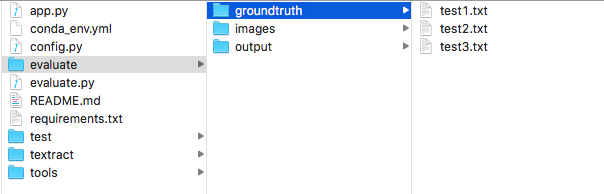

# Textract: An end-to-end OCR python package for scanned documents.
Optical character recognition (OCR) is the technique that allows a computer to read static images of text, and convert them into editable, searchable data. 


Current OCR model, such as Google Cloud Vision, can perform well on text recognition, however, it cannot provide a correct reading order. Textract utilizes image processing techniques for layout analysis and determines the reading order based on topological ordering. The result shows that we can improve 20% Levenshtein similarity on Google OCR model by applying our layout analys


Furthermore, this package also provides other deep learning model, CRNN, for the text recognition. The original CRNN paper can be referred by "[An End-to-End Trainable Neural Network for Image-based Sequence Recognition and Its Application to Scene Text Recognition](https://arxiv.org/abs/1507.05717)" and also thanks to the github [repo](https://github.com/MaybeShewill-CV/CRNN_Tensorflow) for building the Tensorflow version CRNN model.


## Pipeline


## Install
### Dependencies 
You can install all python dependencies by both Anaconda or pip.
```
> conda env create -f conda_env.yml
```
This will create an Anaconda environment **textract**.

or

```
> pip3 install -r requirements.txt
```

### download pretrained model
Please download the [pretrain weights](https://drive.google.com/file/d/1rUiaZJv6XgxCapS3LqgLoax_fW77tpha/view?usp=sharing) and the [model](https://drive.google.com/file/d/1jbh1Oc-uh7TvAIWo121IdbzGRn2yEB75/view?usp=sharing). Put both files in the `./textract/model`.


### Google OCR setting 
Please follow the instructions in [Google Vision API How-to Guild](https://cloud.google.com/vision/docs/before-you-begin?authuser=1) to setup your Google API Services. Remember to download the service account key (.json file) and add it as an environment variable in your computer. 
```
> export GOOGLE_APPLICATION_CREDENTIALS = ~/path/to/your/service_account_key.json
```

For more detail, you can watch this youtube video, [Setting up API and Vision Intro - Google Cloud Python Tutorials p.2](https://www.youtube.com/watch?v=nMY0qDg16y4)

## Quick Start
You can run a simple test easily by execute the below command in the terminal. The output text file will be generated into your output folder.
```
> python app.py --img_dir ./path/to/image/folder --out_dir ./path/to/output/folder 
```
For example, 
```
> python app.py --img_dir ./test/images --out_dir ./test/output
```


Then, you will get your ocr text files in your output folder.


## Evaluation
If you want to do the similarity test for a batch images, you can utilize the `evaluate.py`. The image folder should be organized as below structure (but the folder name can be arbitrary).

* your images folder


* your groundtruth file folder


Then, run the below command in your terminal.
```
> python evaluation.py --img_dir path/to/image/folder --gd_dir path/to/groundtruth/folder --out_dir path/to/output/folder
```
For example
```
> python evaluation.py --img_dir ./evaluate/images --gd_dir ./evaluate/groundtruth --out_dir ./evaluate/output
```

* the generated result folder


## Reference
